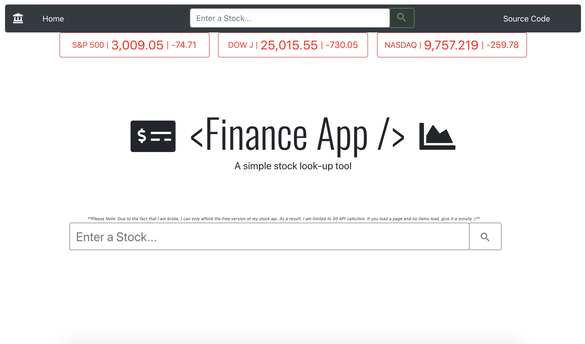
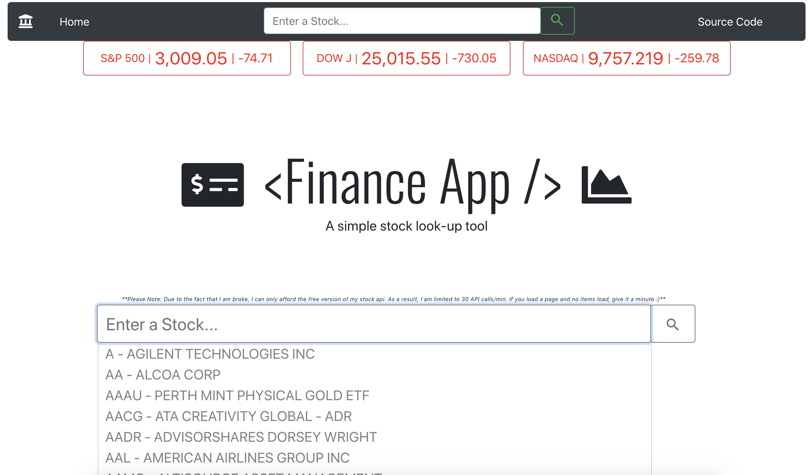
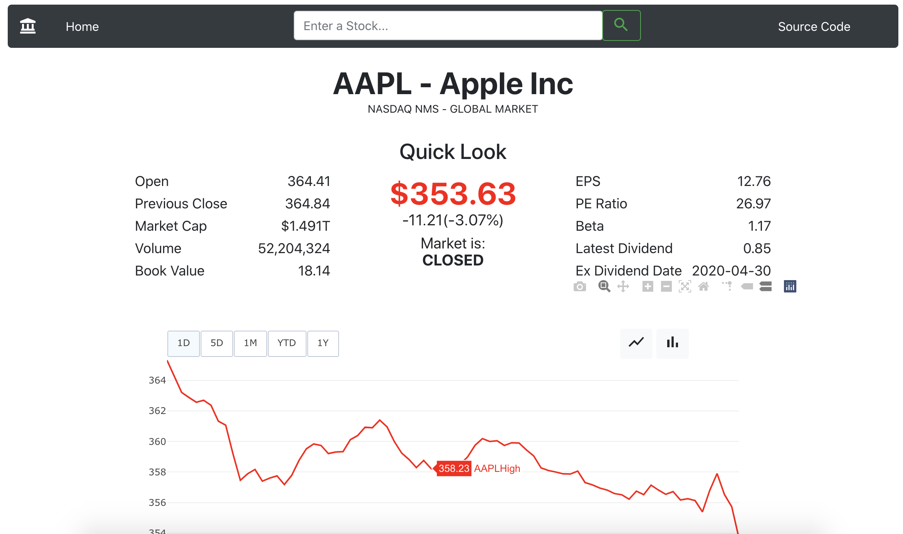
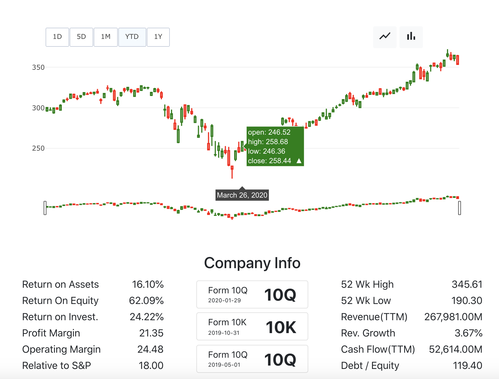

# A web app for financial analysis
### Home Page

### Autocomplete Search-Bar

### Stock Page(Top)

### Stock Page(Bottom)

## What is it?
This handy app utilizes multiple API calls to display information pertaining to a publically listed company. Stock price, stock history, metrics, and financial info; this app displays all of these and more in a simple, easy to use layout.
## What is the purpose of this project?
I was very unfamiliar with HTTP front-end API calls, so this project definitely made me comfortable with that. Financiall analysis is also a hobby of mine, and I really love to do it, so i figured why not combine two of my interests and code a little stock-lookup tool!
## What did I use?
Built with React.js, used Twitter Bootstrap v4. I utilized two api's, [Finnhub.io](https://www.finnhub.io) and [IEX Cloud](https://www.iexcloud.io). I used Plotly.js for the graph displayed at each stock information page. WebHooks are used to subscribe to real time price updates during market hours, using Finnhub.io as well!
## Why on earth did I use two APIs?
Because these APIs are very pricey, haha. I'm utilizing both APIs free-versions. I prefer Finnhub.io, as its docs are easier to navigate. But, they only allow be 30 API calls a minute :/.
